# TextSwap 📗

## Table of Contents: 
- [Overview](#overview)
- [User Guide](#user-guide)
  - [Landing Page](#landing-page)
  - [Buy Page](#buy-page)
  - [Sell Page](#sell-page)
  - [Cart Page](#cart-page)
  - [Account Page](#account-page)
  - [Payment Page](#payment-page)
  - [Admin Page](#admin-page)
- [Milestones](#milestones)
- [Community Feedback](#community-feedback)
- [Developer Guide](#developer-guide)

## Overview: 
Manoa TextSwap is a student-driven platform designed to simplify the process of buying and selling secondhand textbooks for the UH Manoa community. The platform enables users to upload used books for sale. Our admin review system ensures that only approved listings appear on the “Buy” page. Users can easily search and filter listings to find textbooks for their specific classes, making the process of acquiring course materials more efficient and affordable. Built with modern web development tools like Next.js and hosted on Vercel, Manoa TextSwap combines a user-friendly interface with tools to streamline textbook exchanges and promote sustainability through reuse.

## [Deployment](https://manoa-textswap.vercel.app/)

## User Guide: 

### Landing Page

 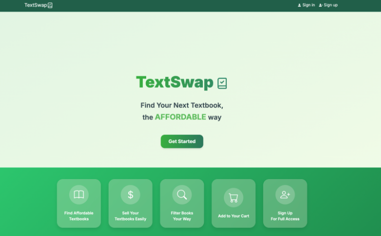 

The sign-up process is accessible by clicking the ‘Get Started’ button or through the link at the top right of the page. The form requires only an email address and a password, ensuring a straightforward registration process. For users with existing accounts, the login page is also located at the top right of the navigation bar. This structure provides clear access to account management features for all users.

#### Login Page

 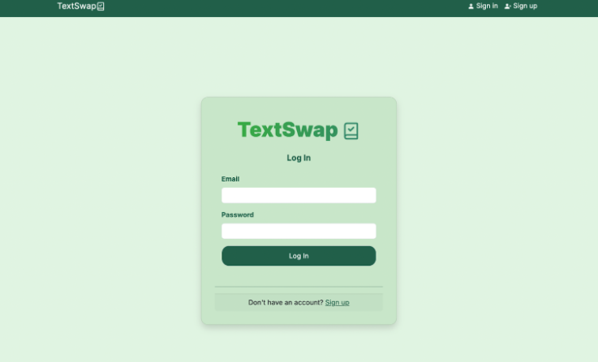 

#### Sign Up Page

 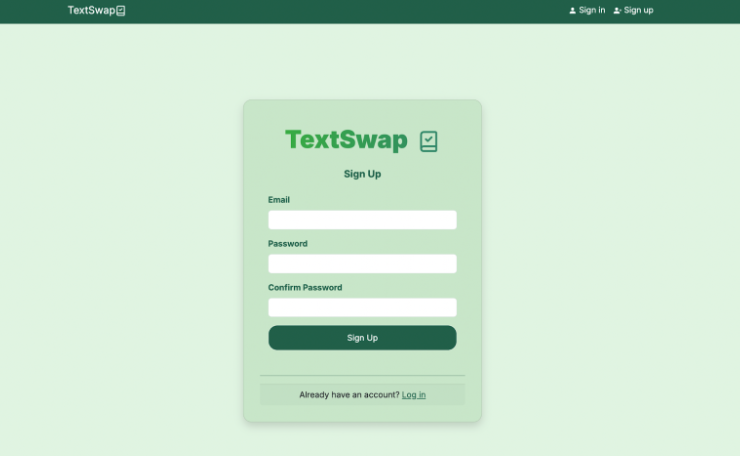 

#### Modal
Clicking on any of the boxes opens a preview modal that provides an overview of the website. This feature allows users without an account to still explore the platform’s functionality, offering insight into how textbooks are listed and sold.

 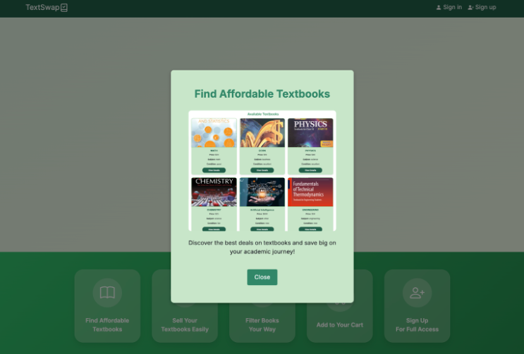 

 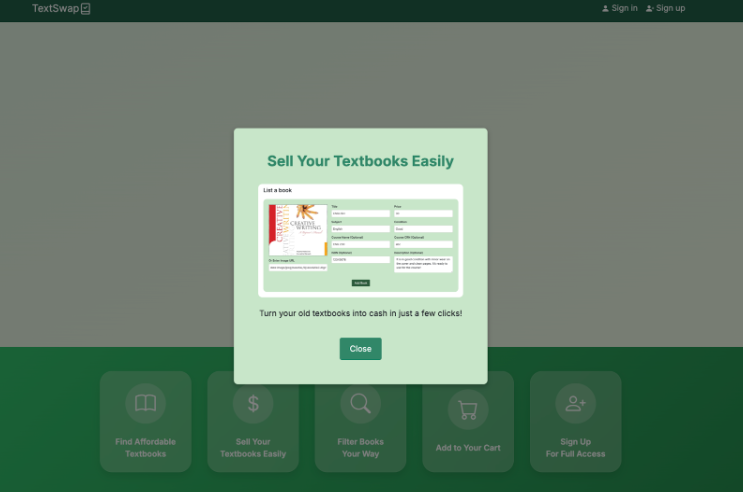 

#### NavBar
On typical laptop and full screens, the navigation bar is displayed horizontally and includes options such as Buy, Sell, Cart, and Account, with an additional Admin link for admin accounts positioned before the Buy option. On smaller screens, the navbar transitions into a compact hamburger-style menu, represented by an icon that expands to show the same navigation options in a dropdown format for ease of use.

 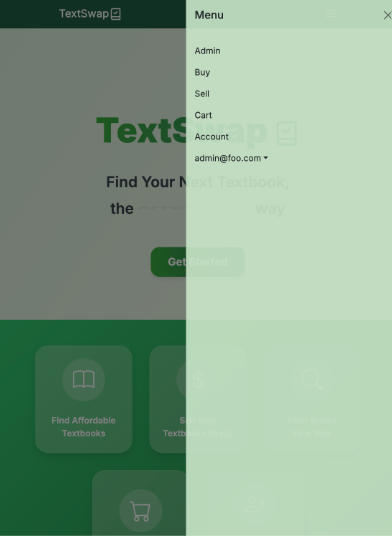 

#### Change Password Page
Changing your password and logging out are straightforward processes. By clicking on your email address at the top right of the page, a dropdown menu appears with options to change your password or log out. Selecting "Change Password" prompts you to confirm your current password before allowing you to set a new one, ensuring security. Choosing "Sign Out" logs you out of your account and redirects you to the landing page of the website. This setup ensures quick and secure access to account management functions.

 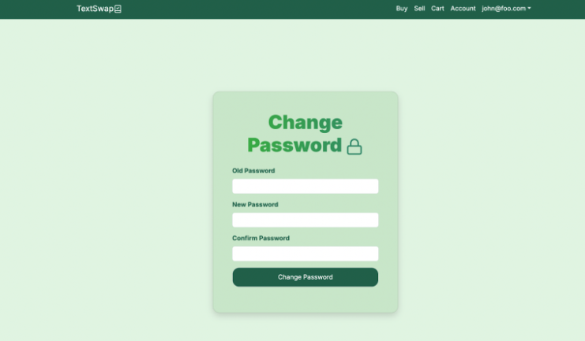 

#### Sign Out Page

 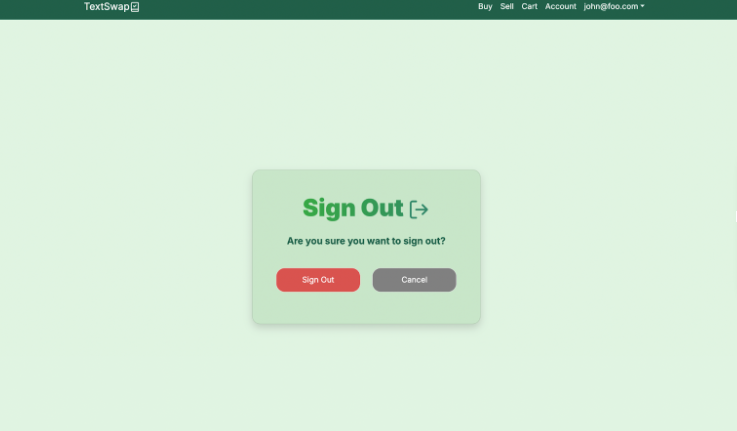 

### Buy Page

#### Filters

 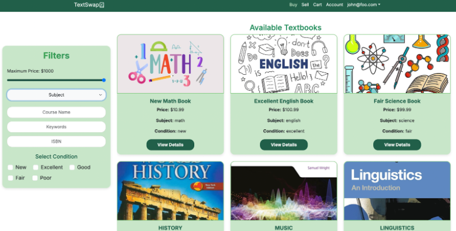 

#### List of Subjects
The Buy page includes a comprehensive filter system to help users find the right textbook. It features a price range slider for setting budget preferences, a dropdown menu to select from various subjects, and an optional input field for typing a course name, keywords, or ISBN. Additionally, users can specify their preferred condition for the textbook, ensuring a tailored and efficient search experience.

 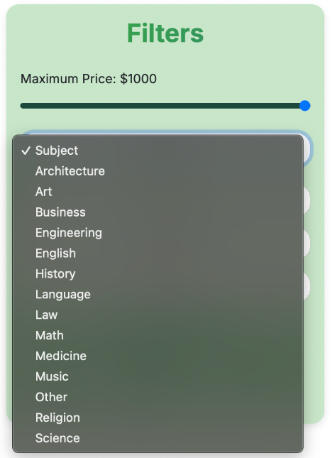 

#### View Details
The Available Textbooks section dynamically displays textbooks based on the filters applied, including information about the owner of each textbook. Each textbook entry includes a "View Details" button, which provides more in-depth information about the selected book. Additionally, there are two action buttons: "Buy Now," which redirects the user to the payment page for immediate purchase, and "Add to Cart," which saves the selected textbook to the user's cart page for future review or purchase. This setup streamlines the browsing and purchasing process for users. 

 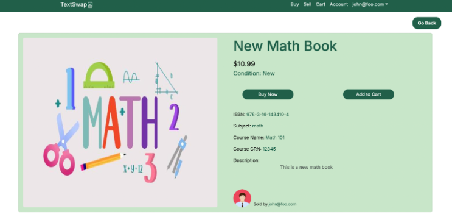 

#### Account Pictures 
Admin has the remove button 
For our admin account, the View Details page includes an additional feature: a "Remove Book" button. This functionality allows the admin to delete a textbook listing if necessary. This feature is designed to ensure the accuracy and quality of the listings by enabling the team to manage and maintain the database effectively.

 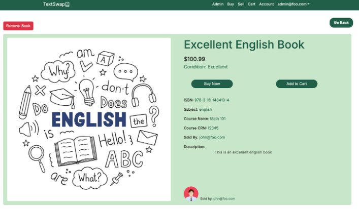 

### Sell Page

 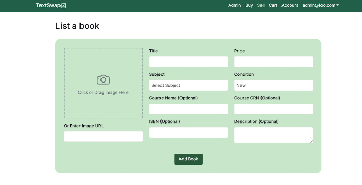 

#### Image Preview
Ability to upload straight from their laptop (not just image links)
Draggable 
Just copying & pasting image links in the bottom box works
This will also show the preview image in the picture section above 

  

### Cart Page
The Cart Page displays a list of textbooks saved by users via the "Add to Cart" button. Each textbook entry includes a "Buy Now" button that directs the user to the payment form for immediate purchase and a delete icon for removing the textbook from the cart if it is no longer needed. Additionally, the author of each listed textbook is shown, making it easy for users to manage their selections while having all relevant details readily available.
If a user is the owner of a textbook, the "Add to Cart" button is disabled to prevent them from adding their own books to the cart.

 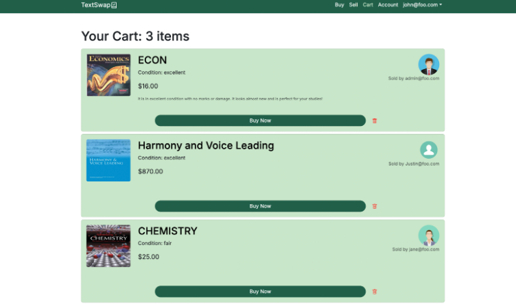 

### Account Page 
Profile picture is presetup for 

 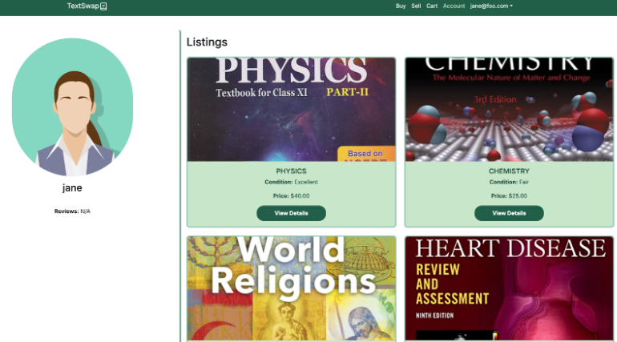 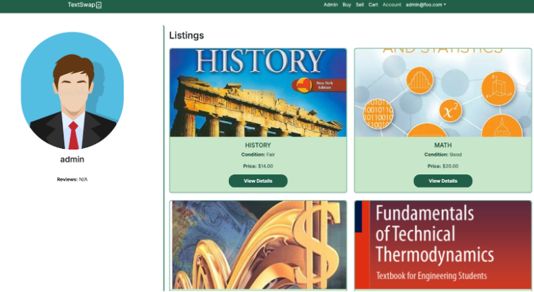 

 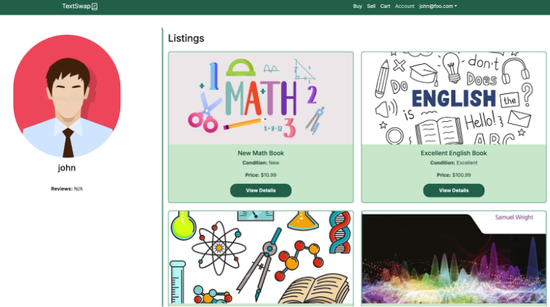 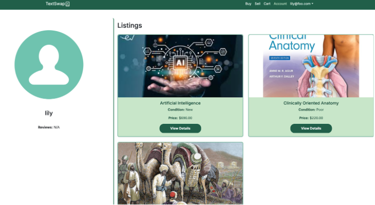 

#### Listing of Books Owned

  

### Payment Page 

The payment page serves as a placeholder to simulate a secure payment process, accessible through the “Buy Now” button. While users can type in information such as card details, names, and billing addresses, no actual payment or transaction occurs. This feature is designed to demonstrate how a payment system would function within the platform, providing a realistic user experience without processing real transactions. 

 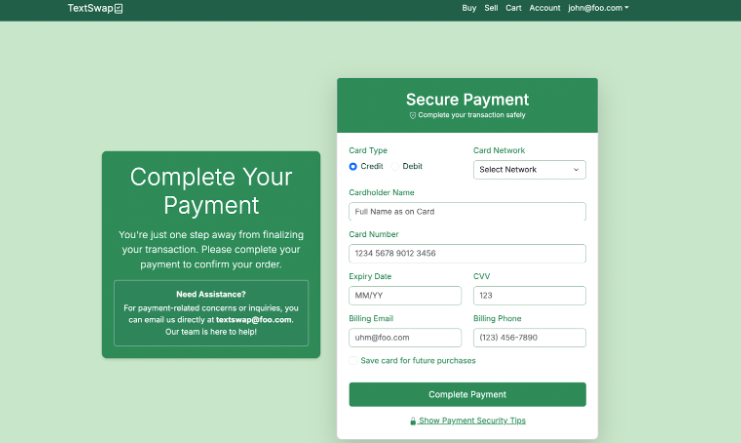 

### Admin Page 

The admin page serves as a central hub for monitoring and managing books uploaded by users, ensuring a safe and reliable environment for all participants. Admins can either approve or remove listings. Approved books are immediately displayed on the “Buy” page, making them accessible for users to browse and purchase. Removed listings are permanently deleted from the system, maintaining the platform’s quality and relevance. Clicking on a book title redirects to a detailed view, allowing admins to review critical information before making decisions. This active monitoring by admins ensures that all interactions on the platform are secure and trustworthy.

  

## Milestones

### Milestone 1
Our first milestone was to get the basic skeleton up and running, with functionality of the landing page and the ability to swap between tabs, but not to have any actually working pages yet. In this goal it was specifically to have a mock-up of the page in order to slowly add functionality over the course of the next two milestones. View our project page [here]().

### Milestone 2
Our second milestone was to start adding minor functionality to the whole site, but not worrying too much about everything working smoothly. This milestone is more of a progress check in to ensure that we can complete the website on time in alignment with our current schedule. In addition, we intended to no longer need mock-ups for this milestone. View our project page [here]().

### Milestone 3
Our third and final milestone was to have the project completely finished and polished. In addition, in this milestone we started to collect community feedback from students in our college who are not part of our class. The feedback from the individuals we got reviews from are listed in the "Community Feedback" section. View our project page [here]().

## Community Feedback: 

#### Sam Tiwanak: 
Manoa Textswap is an intuitive site that simplifies a common issue for UH students. Often books just go unused after a course. With this website, I was able to easily navigate and even upload potential books I would want to sell. I think it’s a great idea and the layout works well.

#### Person 2:

#### Person 3: 

#### Person 4: 

#### Person 5: 

## Developer Guide: 

### Downloading
* Clone to GitHub Desktop
* Open in Visual Studio Code

### Installing
* npm install 
* Other dependencies as necessary (bootstrap react, formik, axios, yup,etc)

### Running/Modifying
* Set up a .env file in the root of the project. Configure PostgreSQL database. Sign up with a GitHub on Cloudinary account and then include in .env file the following fields. 
* DATABASE_URL="postgresql:/username:password@localhost:5432/mydb?schema=public"
* CLOUDINARY_CLOUD_NAME= 
* CLOUDINARY_API_KEY= 
* CLOUDINARY_API_SECRET=
* npm run dev

#### This page is run and maintained by Ellie Ishii, Xingyao He, Dhaniel Bolosan, and Logan Teachout
